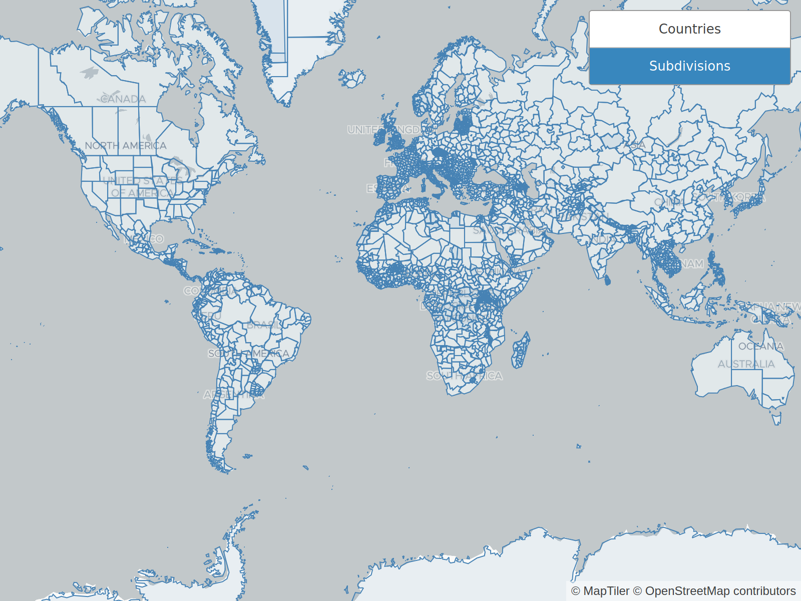

# OSM Regions

Extract region geometries (ISO 3166 countries and subdivisions) from OpenStreetMap in order to create a region dataset compatible with [OpenMapTiles](https://openmaptiles.org/). This allows highlighting of countries, states, provinces, etc.

⚡ **[Preview the data](https://osm-regions.netlify.app/)**
Reduced quality, up to zoom level 8

## Data

The following data is provided:

- [Land borders of countries](https://github.com/nzzdev/osm-regions/releases/download/v0.1.0/countries-v0.1.0.zip) (as defined in [ISO_3166-1](https://en.wikipedia.org/wiki/ISO_3166-1)) extracted from OpenStreetMap as GeoJSON
- [Land borders of subdivisions](https://github.com/nzzdev/osm-regions/releases/download/v0.1.0/subdivisions-v0.1.0.zip) (as defined in [ISO_3166-2](https://en.wikipedia.org/wiki/ISO_3166-2)) extracted from OpenStreetMap as GeoJSON
- [Vector tile set in mbtiles format](https://github.com/nzzdev/osm-regions/releases/download/v0.1.0/regions-v0.1.0.zip) with 2 layers (countries, subdivisions) for simplified rendering of the data, compatible with OpenMapTiles

## License

This data is Copyright 2020 OpenStreetMap contributors. It is available under the Open Database License (ODbL).
For more information see https://www.openstreetmap.org/copyright

The code in this repository is licensed under the MIT license.

### Rebuilding the data

Have a look at [the steps required to extract and prepare the data](STEPS.md)

## Uses

This data is used in the [Q Locator Map Tool](https://github.com/nzzdev/Q-locator-map),
for which a [demo](https://editor.q.tools) is also available.

## Gallery

### Countries (overview)

### Subdivisions (overview)

### Close-ups

