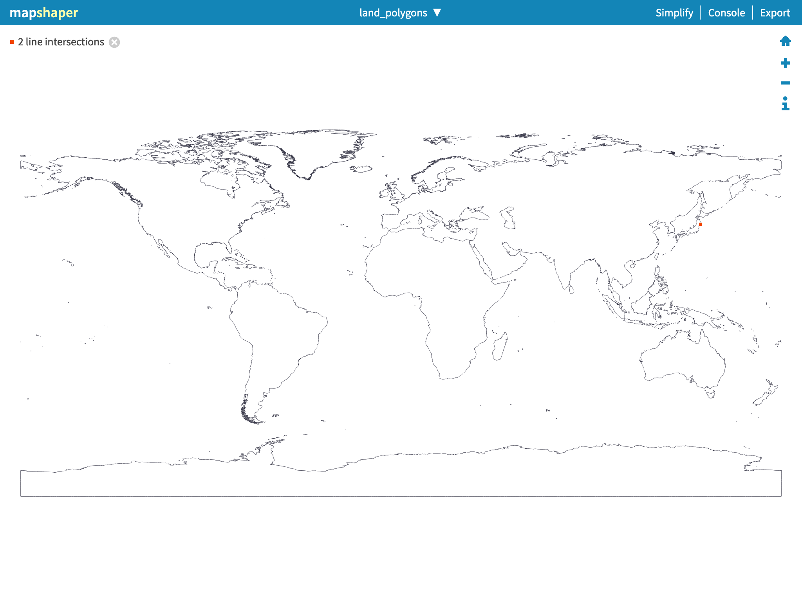

# Import regions from OpenStreetMap

The total process takes about 1 hour.

## Prerequisites

### Land polygons

Download "WGS 84, Large polygons not split" from osmdata, unpack and store the shapefile in

- `00-static-data/land-polygons-complete-4326`

Direct link: https://osmdata.openstreetmap.de/download/land-polygons-complete-4326.zip

Landing page: https://osmdata.openstreetmap.de/data/land-polygons.html

You may want to open the file in mapshaper and check that the polygons do not self-intersect, because clipping with self-intersecting polygons will corrupt data. For example, clipping with these polygons removes most of Japan from the output:



You can also use
[this snapshot of land polygons](https://github.com/nzzdev/osm-regions/releases/download/v0.2.0/osmdata-land-polygons-v0.2.0.zip)
with correct polygons.

### Natural earth

Natural earth data (1:10m Cultural Vectors) is used for zoom levels 0 to 4 for compatibility with OpenMapTiles.

Download "countries" and "states and provinces" and unpack and store the shapefiles in

- `00-static-data/ne_10m_admin_0_countries`
- `00-static-data/ne_10m_admin_1_states_provinces`

Direct links:
- https://naciscdn.org/naturalearth/10m/cultural/ne_10m_admin_0_countries_ukr.zip
- https://naciscdn.org/naturalearth/10m/cultural/ne_10m_admin_1_states_provinces.zip

Landing page: https://www.naturalearthdata.com/downloads/10m-cultural-vectors/

Notes: We currently use the ukrainian 'point of view' data for admin level 0. See https://github.com/nvkelso/natural-earth-vector/issues/489 for further details.
## Dependencies

Run

```bash
npm install
```

to install the dependencies.

## Steps

Run this script to execute all steps listed below:

```bash
import-osm/import-osm.sh
```

#### 1. Query list of countries (Overpass)

Input: Nothing.
Output: List of countries with ISO3166-1 codes.

#### 2. Query regions by country (Overpass)

Input: List of countries with ISO3166-1 codes.
Output: For every country, one GeoJSON file with country and subdivision polygons.

Also store raw data only download if raw data is not available.

#### 3. Clip with land polygons

Input: For every country, one GeoJSON file with country and subdivision polygons.
Output: For every country, one GeoJSON file with country and subdivision polygons.

#### 4. Reduce regions (remove small disconnected parts, e.g. remove French Guiana from France)

Input: For every country, one GeoJSON file with country and subdivision polygons.
Output: For every country, one GeoJSON file with country and subdivision polygons.

#### 5. Split by region

Input: For every country, one GeoJSON file with country and subdivision polygons.
Output: For every region, one GeoJSON file.

#### 6. Simplify regions

Input: For every region, one GeoJSON file.
Output: For every region, one GeoJSON file.

#### 7. Merge regions

Input: For every country, one GeoJSON file with country and subdivision polygons.
Output: One GeoJSON file with all countries, one GeoJSON file with all subdivisions.

#### 8. Generate vector tiles

Input: One GeoJSON file with all countries, one GeoJSON file with all subdivisions.
Output: mbtiles file with 2 layers (countries, subdivisions).

#### 9. Convert natural earth data to GeoJSON

Input: Shapefiles with countries and states/provinces.
Output: GeoJSON files with countries and states/provinces.

#### 10. Generate vector tiles (natural earth)

Input: GeoJSON files with countries and states/provinces.
Output: mbtiles file with 2 layers (countries, subdivisions).

#### 11. Join tiles

Input: mbtiles files from steps 8/10.
Output: mbtiles file with 2 layers (countries, subdivisions), using natural earth data for zoom levels 0-4 and Openstreetmap data for zoom levels 5-10.

### Clean up

Run this to remove all `output` folders:

```bash
import-osm/remove-outputs.sh
```

# Preview vector tiles

Run this script to preview the vector tiles generated in step 11.

```bash
import-osm/preview-tiles.sh
```
